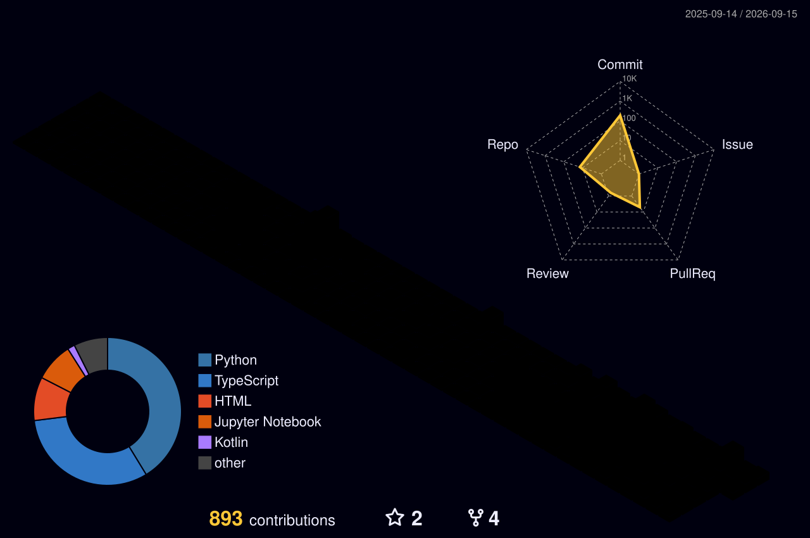

<div align="center">

[](https://git.io/typing-svg)

<br/>

<a href="mailto:umarfarooq3152@gmail.com"></a>
<a href="https://github.com/umarfarooq3152"></a>


</div>

---

<br/>


```python
class UmarFarooq:
    location  = "Lahore, Pakistan 🇵🇰"
    stack     = ["Python", "TypeScript", "Kotlin"]
    builds    = ["AI products", "web apps",
                 "Android", "data pipelines"]
    currently = "turning ideas into software"
    reach_me  = "umarfarooq3152@gmail.com"
```

<br clear="right"/>

---

## Contribution Landscape

<div align="center">



</div>

---

## Snake

<div align="center">

<picture>
  <source media="(prefers-color-scheme: dark)" srcset="dist/snake-dark.svg"/>
  <source media="(prefers-color-scheme: light)" srcset="dist/snake.svg"/>
  
</picture>

</div>

---

## Stats

<div align="center">


&nbsp;&nbsp;&nbsp;


<br/><br/>

[](https://github.com/ryo-ma/github-profile-trophy)

</div>

---

## Stack

<div align="center">


</div>

---

## Projects

<div align="center">

<a href="https://github.com/umarfarooq3152/Ecommerce-Analysis">
  
</a>
<a href="https://github.com/umarfarooq3152/Modernist-ai">
  
</a>

<a href="https://github.com/umarfarooq3152/Fair-Gig">
  
</a>
<a href="https://github.com/umarfarooq3152/SkillUP">
  
</a>

</div>

---

## Activity

<div align="center">

[](https://github.com/ashutosh00710/github-readme-activity-graph)

</div>

<br/>


